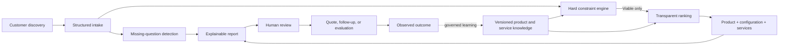

# Evidence-Based Solution Advisor

Turn structured discovery into explainable product, configuration, and service recommendations for complex technical sales.

## What this is for

A customer usually knows what is going wrong, but not which specification, product, or service will fix it. They may ask for a part number because that is the only language available to them. Recommending from that request alone is an expensive guess.

This project demonstrates a better approach:

1. Capture the customer's actual work, bottleneck, environment, economics, and deadline.
2. Identify the important questions that remain unanswered.
3. Reject products that cannot satisfy hard requirements.
4. Rank only the viable choices.
5. Recommend services needed to make the solution work after delivery.
6. Generate an adaptive, evidence-grounded conversation guide.
7. Explain the evidence, tradeoffs, and uncertainty behind the result.
8. Require a qualified human to approve anything that becomes a quote or customer commitment.

The included example is a professional-workstation advisor. The architecture can support other configurable products and services by replacing the vertical-specific specification fields, rules, questions, and sample catalog.

> **Important:** Every included company, product, model number, specification, price, lead time, certification, and evidence record is fictional demonstration data. Nothing in this repository is a purchasable product recommendation.

## Practical applications

The same pattern can help:

- A workstation seller determine whether a customer needs more CPU capacity, GPU memory, system memory, storage performance, a different form factor, or a deployment service.
- A solutions engineer catch power, compatibility, certification, support, and delivery problems before a quote is issued.
- A buyer understand why one configuration fits, why another was rejected, and what is still unknown.
- A product or GTM team learn which requirements, missing capabilities, evaluation requests, and lead-time constraints repeatedly affect deals.
- A competitive-intelligence team log dated make, model, model-number, price, lead-time, positioning, strength, and risk observations without confusing them with verified specifications.
- A service business recommend assessment, migration, implementation, training, or support alongside a product.
- A human expert use AI for better questions and clearer explanations without allowing generated prose to override technical facts.

This is not an autonomous closer. It is a transparent decision-support system for situations where a confident but wrong answer is costly. The practical benefit is a more defensible buying decision: fewer avoidable configuration mistakes, fewer deployment surprises, and a clearer explanation of what the customer is paying for.

## Example result

Given a synthetic architecture-firm intake, the advisor can produce:

```text
Leading recommendation
Northstar Labs ArcStation AS-4200

Why it leads
- Meets the stated CPU, GPU-memory, system-memory, and storage constraints
- Carries the required fictional application certification
- Fits the reported circuit capacity
- Fits the synthetic budget and delivery window
- Provides the required support level

Recommended services
- Workload Validation
- Deployment Readiness Assessment
- Migration and Rollout
- Application and Workflow Optimization

Rejected alternative
Northstar Labs ArcStation AS-2100
- GPU memory is below the hard minimum
- System memory is below the hard minimum
- Required application certification is absent
```

The generated report also includes the scoring dimensions, unresolved facts, next questions, and rejection reasons.

## How it works



The deterministic core has no language-model dependency and uses only the Python standard library. An AI layer could later help conduct discovery and explain results, but it must not invent product facts or override failed constraints.

## Quick start

Requires Python 3.10 or newer.

```powershell
python -m pip install -e .
solution-advisor recommend examples/intakes/architecture-and-engineering.json `
  --json-out outputs/aec-recommendation.json `
  --markdown-out outputs/aec-recommendation.md
```

Or run it without installing:

```powershell
$env:PYTHONPATH = "src"
python -m solution_advisor recommend examples/intakes/mobile-media-production.json
```

Other examples:

```powershell
solution-advisor recommend examples/intakes/local-ai-development.json
solution-advisor recommend examples/intakes/incomplete-discovery.json
```

The incomplete example deliberately leaves important facts unresolved. The engine labels the result `provisional_recommendation` while clearly listing missing questions and unknown constraints.

## Tests

```powershell
$env:PYTHONPATH = "src"
python -m unittest discover -s tests -v
```

## Repository map

```text
knowledge/workstations/products/  Fictional product records
knowledge/workstations/competitive-observations/  Dated fictional market snapshots
knowledge/workstations/services/  Service offers and matching triggers
knowledge/workstations/rules/     Constraints, scoring, and next questions
examples/intakes/                  Synthetic customer-discovery cases
schemas/                           Stable data envelopes and extension points
src/solution_advisor/              Deterministic recommendation engine
tests/                             Behavioral and safety-boundary tests
docs/                              Architecture, method, and governance
```

## Product identity and flexible specifications

Every product uses a stable identity envelope:

```json
{
  "identity": {
    "make": "Northstar Labs",
    "model": "ArcStation",
    "model_number": "AS-4200"
  },
  "vertical": "workstation",
  "vertical_schema_version": "1.0",
  "specifications": {}
}
```

The `specifications` object belongs to the product vertical. Workstations include CPU; GPU; memory capacity, type, and speed; storage capacity and type; power; operating systems; certifications; and, for laptops, detailed display specifications. A different vertical can define its own fields without forcing workstation vocabulary onto unrelated products.

See [Extending a Vertical](docs/EXTENDING-A-VERTICAL.md).

## Design boundaries

- Hard constraints run before scoring.
- A failed hard constraint cannot be rescued by a high weighted score.
- Missing customer facts appear as unknowns or next questions.
- Product facts carry source, observation date, and confidence metadata.
- Competitive observations remain dated context and cannot override hard product evidence.
- Sample price and lead time are explicitly synthetic and time-bound concepts.
- Manufacturer claims, third-party observations, internal validation, recommendations, approvals, sales, and outcomes should remain distinct evidence classes.
- The engine recommends; a qualified person decides.
- No customer personally identifiable information belongs in the public examples.

## What this is not

- A production CPQ system
- A substitute for engineering validation
- A product scraper
- A live pricing or availability source
- An autonomous quoting agent
- Proof that the recommendation improves win rate
- A claim that more hardware is always the correct answer

## Project status

`v0.1` is a public reference implementation and portfolio-quality working prototype. The meaningful next validation is not another feature: it is evaluation by experienced sellers or solutions engineers using representative cases.

Suggested evidence gate:

- Five representative cases evaluated
- No invented or unsupported product facts
- Important missing facts surfaced before recommendation
- Experts find the rejection logic technically defensible
- Top-two ranking is useful even where experts adjust the weights
- At least two practitioners identify a real workflow they would test

Reassess or narrow the project if users want only a static questionnaire, product-data maintenance overwhelms the value, or recommendations change mainly because of wording rather than structured facts and rules.

## Documentation

- [Architecture](docs/ARCHITECTURE.md)
- [Methodology](docs/METHODOLOGY.md)
- [Knowledge Governance](docs/KNOWLEDGE-GOVERNANCE.md)
- [Review Intelligence Integration](docs/REVIEW-INTELLIGENCE-INTEGRATION.md)
- [Extending a Vertical](docs/EXTENDING-A-VERTICAL.md)

## License

Licensed under the [Apache License 2.0](LICENSE).
